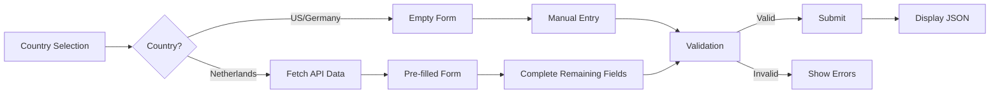

# KYC Flow App

A dynamic iOS application that implements country-specific KYC (Know Your Customer) forms with SwiftUI. The app loads form configurations from YAML/JSON files and renders forms dynamically based on country requirements, with special handling for the Netherlands where certain fields are fetched from an API.

## 📱 Features

- **Dynamic Form Rendering**: Forms are generated from YAML/JSON configuration files
- **Multi-Country Support**: Netherlands (NL), United States (US), and Germany (DE)
- **Field Types Support**: Text, Number, and Date inputs
- **Comprehensive Validation**:
  - Required field validation
  - Regex patterns with custom error messages
  - Min/Max length for text fields
  - Min/Max value for number fields
- **Netherlands Special Case**: First name, last name, and birth date are fetched from API and displayed as read-only
- **Form Submission**: Displays collected data in JSON format

## 🏗 Architecture

The application follows **MVVM architecture** with a clean data layer separation and feature-based organization:

```
KYCFlowApp/
├── App/                          # Application layer
│   ├── KYCFlowAppApp.swift     # App entry point
│   ├── ContentView.swift        # Main navigation
│   └── DIContainer.swift        # Dependency injection
├── Domain/                       # Business models
│   └── Models/
│       ├── KYCConfiguration.swift    # Form configuration model
│       ├── FormField.swift           # Field definition
│       ├── ValidationRule.swift      # Validation rules
│       ├── DataSource.swift          # Data source definition
│       └── UserProfile.swift         # User profile from API
├── Data/                         # Data layer
│   ├── Repositories/       
│   │   ├── Protocols/                # Repository interfaces
│   │   └── Implementations/          # Concrete implementations
│   └── Services/          
│       └── ValidationService.swift   # Validation logic
├── Presentation/                 # UI layer (Feature-based)
│   ├── CountrySelection/        # Country selection feature
│   │   ├── CountrySelectionView.swift
│   │   └── CountrySelectionViewModel.swift
│   ├── DynamicForm/             # Form rendering feature
│   │   ├── DynamicFormView.swift
│   │   ├── DynamicFormViewModel.swift
│   │   ├── FormFieldState.swift
│   │   ├── FormFieldView.swift
│   │   └── InputFieldView.swift
│   └── SubmissionResult/        # Result display feature
│       ├── SubmissionResultView.swift
│       └── SubmissionResultViewModel.swift
├── Resources/             
│   └── Configurations/          # YAML config files
│       ├── nl.yaml
│       ├── us.yaml
│       └── de.yaml
└── Util/                        # Utilities
    ├── YamlParser.swift         # YAML parsing
    └── YamlParsing.swift        # Protocol for YAML parsing
```

### Architecture Highlights

- **Feature-Based Organization**: Each presentation feature (CountrySelection, DynamicForm, SubmissionResult) has its own folder with View and ViewModel
- **Clean Separation**: Domain, Data, and Presentation layers are clearly separated
- **Dependency Injection**: DIContainer in the App layer manages all dependencies
- **Protocol-Oriented**: Repository protocols enable easy mocking and testing
- **MVVM Pattern**: Each View has a corresponding ViewModel for business logic

## 🇳🇱 Netherlands Special Case Implementation

### The Challenge
The Netherlands has a special requirement where `first_name`, `last_name`, and `birth_date` must be fetched from an API and displayed as read-only fields. This requirement was not supported in the initial design, requiring an architectural solution.

### Our Solution: Batched API Request Strategy with DataSource Configuration

We extended the YAML configuration format to support data sources, allowing fields to specify where their data comes from:

```yaml
country: NL
dataSources:
  - id: user_profile
    type: api
    endpoint: /api/nl-user-profile
    fields: [first_name, last_name, birth_date]  # Fields provided by this source
    
fields:
  - id: first_name
    label: First Name
    type: text
    required: true
    dataSource: user_profile  # Links to API data source
    readOnly: true 
    
  - id: last_name
    label: Last Name
    type: text
    required: true
    dataSource: user_profile  # Same source = single API call
    readOnly: true
    
  - id: birth_date
    label: Birth Date
    type: date
    required: true
    dataSource: user_profile  # Batched with other fields
    readOnly: true
    
  - id: bsn
    label: BSN
    type: text
    required: true
    validation:
      regex: '^\d{9}$'
      message: 'BSN must be 9 digits'
    # No dataSource = manual entry field
```

### Implementation Details

1. **Data Source Grouping**: On form load, fields are grouped by their `dataSource` ID
2. **Batch Loading**: A single API call is made per unique data source
3. **Field Population**: All fields from the same source are populated simultaneously
4. **Read-Only Enforcement**: Fields with a `dataSource` are automatically read-only
5. **Validation Handling**: Read-only fields skip client-side validation

### Benefits of This Approach

- ✅ **Efficient**: Single API call for related fields
- ✅ **Explicit**: Configuration clearly shows data dependencies
- ✅ **Extensible**: Easy to add new data sources or fields
- ✅ **Backward Compatible**: Countries without data sources work as before
- ✅ **Testable**: Mock repositories can be injected for testing

## 📝 Configuration Format Improvements

### Current Enhanced Format

We've made the following improvements to the original YAML format:

1. **Added `dataSources` section**: Defines external data sources
2. **Added `dataSource` field property**: Links fields to data sources
3. **Added `readOnly` field property**: Explicitly marks read-only fields
4. **Support for validation arrays**: Multiple validation rules per field with individual messages

Example of enhanced validation:
```yaml
validation:
  - type: minLength
    value: 3
    message: "Must be at least 3 characters"
  - type: regex
    value: "^[a-zA-Z]+$"
    message: "Only letters allowed"
```

## 🚀 Getting Started

### Prerequisites

- Xcode 16.4 or later
- iOS 17.0+ deployment target
- Swift 5.9+

### Installation

1. Clone the repository:
```bash
git clone https://github.com/omerturhan/KYCFlowApp.git
cd KYCFlowApp
```

2. Open in Xcode:
```bash
open KYCFlowApp.xcodeproj
```

3. Build and run:
- Select iPhone 16 simulator
- Press `Cmd + R` to run

### Running the App

1. **Country Selection**: Choose from NL, US, or DE
2. **Form Completion**: 
   - **Netherlands**: Some fields are pre-filled from API (read-only)
   - **US/Germany**: All fields are manually entered
3. **Submit**: View the collected data in JSON format

## 🧪 Testing

### Run All Tests
```bash
xcodebuild test -project KYCFlowApp.xcodeproj -scheme KYCFlowApp -destination 'platform=iOS Simulator,name=iPhone 16'
```

### Test Coverage
- ✅ Unit tests for ViewModels and Services
- ✅ Snapshot tests for all UI components
- ✅ Integration tests for country-specific flows
- ✅ Mock API responses for Netherlands

## 🔌 Mocked API Implementation

The app includes a realistic mocked API implementation that simulates proper JSON parsing and field-specific data fetching:

### How It Works

1. **JSON Response Simulation**: Mock API response is stored as JSON string and parsed like a real API response
2. **Field-Specific Fetching**: Only requested fields from the dataSource configuration are returned
3. **Network Delay**: Simulated 500ms delay for realistic behavior
4. **Field ID Matching**: JSON keys match YAML field IDs for seamless data binding

### Example API Response

**Endpoint**: `/api/nl-user-profile`  
**Requested Fields**: `["first_name", "last_name", "birth_date"]`

**Mock Response**:
```json
{
  "first_name": "Jan",
  "last_name": "van der Berg",
  "birth_date": "1985-03-15"
}
```

The JSON keys match exactly with the field IDs defined in the YAML configuration, ensuring proper data population in the form.

### Implementation Details

The `MockUserProfileRepository`:
- Parses JSON strings to simulate real API behavior
- Filters responses to only include fields specified in the YAML dataSource
- Returns `null` for requested fields that don't exist in the mock data
- Throws proper errors for invalid endpoints or JSON parsing failures

This approach ensures the mock behaves like a real API, making it easy to replace with actual backend integration.

## 🎯 Key Implementation Decisions

### 1. Repository Pattern
We use the repository pattern to abstract data sources, making it easy to swap between mock and real implementations.

### 2. Dependency Injection
DIContainer manages all dependencies, enabling easy testing and configuration changes.

### 3. ViewModels with @MainActor
All ViewModels are marked with @MainActor to ensure UI updates happen on the main thread.

### 4. Snapshot Testing
We use snapshot tests to catch UI regressions and ensure consistent rendering across devices.

### 5. Configuration Parsing
Support for both YAML and JSON formats, with YAML being preferred for readability.

## 📊 Validation Rules

The app supports comprehensive validation:

| Rule Type | Description | Example |
|-----------|-------------|---------|
| `required` | Field must have a value | `required: true` |
| `regex` | Pattern matching | `regex: '^\d{9}$'` |
| `minLength` | Minimum text length | `minLength: 3` |
| `maxLength` | Maximum text length | `maxLength: 50` |
| `minValue` | Minimum number value | `minValue: 18` |
| `maxValue` | Maximum number value | `maxValue: 100` |

Each validation rule can have a custom error message for better user experience.

## 🔄 App Flow



## 📋 Evaluation Criteria Met

✅ **Correctness of form behavior**: All fields render and validate correctly  
✅ **Code readability and maintainability**: Clean MVVM architecture with clear separation  
✅ **Handling of dynamic configuration**: Fully dynamic form generation from YAML  
✅ **Elegance of NL solution**: Batched API approach with explicit data sources  
✅ **Thoughtful documentation**: Comprehensive README with architectural decisions  

## 🤝 Contributing

This project was created as a technical assessment. For any questions or feedback, please open an issue.

## 📄 License

This project is for assessment purposes only.
